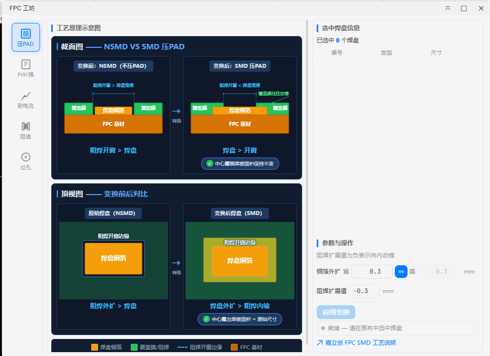
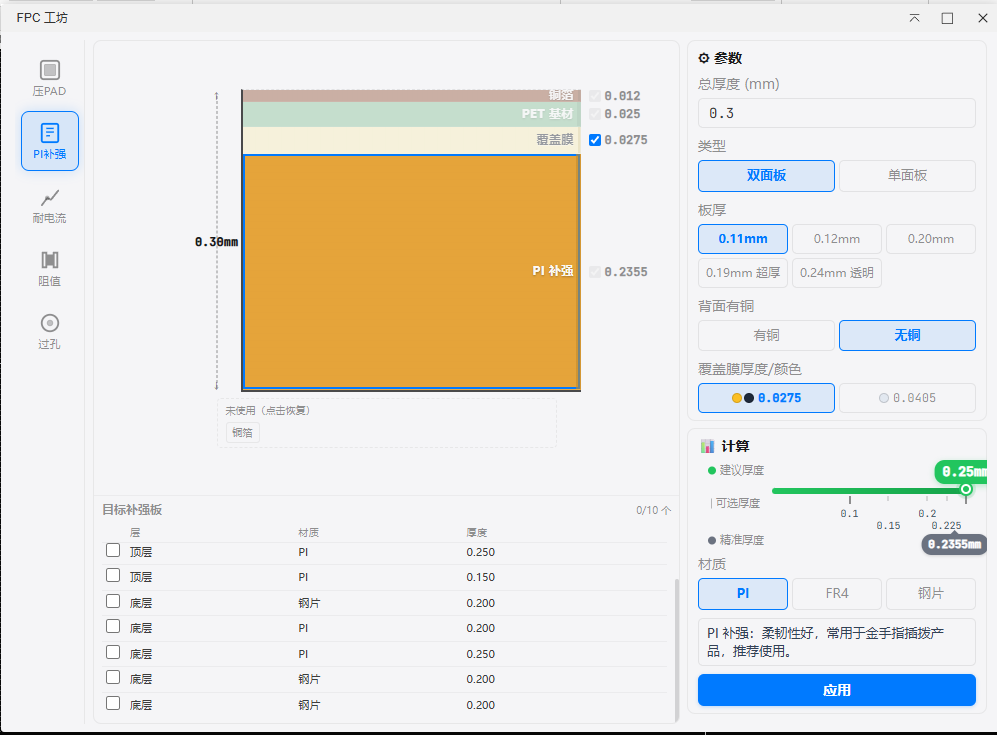

# FPC Workshop

> [简体中文](./README.md) | **English** | [繁體中文](./README.zh-Hant.md) | [日本語](./README.ja.md) | [Русский](./README.ru.md)

FPC (Flexible Printed Circuit) design enhancement tool for stiffener design, pad solder mask processing, and electrical parameter calculation.

## Features

### Press-PAD

One-click solder mask expansion on selected pads to enhance FPC bonding strength. Supports NSMD ↔ SMD auto-conversion.

- Auto-detect pad types (RECT / ELLIPSE / OVAL / NGON)
- Adjustable mask expansion with preprocessing mode
- Real-time change preview

### PI Stiffener Calculator

Precise PI reinforcement thickness calculation for gold finger areas. Derives standard PI thickness from total FPC thickness, layer stack, and material type.

- **2D Cross-Section Visualization**: 7-layer FPC stack rendered proportionally with layer toggle and hover
- **Material System**: PI / FR4 / Steel with independent thickness sets per material
- **Tolerance-First Recommendation**: +0.03mm positive tolerance preferred (interference fit) → -0.01mm negative → no recommendation
- **Dual-Indicator Ruler**: 🟢 recommended thickness (standard) + ⬤ exact thickness (calculated), compared on the same ruler
- **Legend**: Color-coded quick identification of ruler elements
- **EDA Integration**: Canvas stiffener detection → copper check → one-click apply
- **Multi-Select Batch**: Table multi-select stiffeners for batch material/thickness write
- **Dark Mode**: Full EDA dark/light dual-theme auto-switching

### Quick Calculators

Trace current capacity / coil resistance / via current estimation.

## Compatibility

| Platform | Required |
|----------|----------|
| 嘉立创EDA 专业版 | ≥ 3.2.152 |
| EasyEDA Pro | ≥ 3.2.152 |

## Installation

Download `fpc-workshop_v*.eext` and install via **Extensions → Local Install** in the EDA client.

## License

Apache License 2.0
